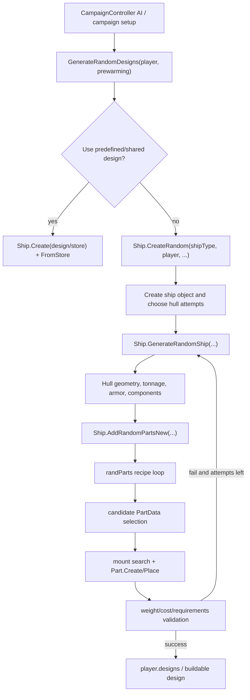

# Ship Generation Design Blueprint

This is a working map for campaign/random ship design generation in this checkout. It is grounded in the decompiled game shape first, then in the current TAF/DIP Harmony patches.

## Goal

The main goal of the current `gg` work is to make campaign ship design generation fast and reliable enough that the campaign remains playable.

The problem is not just isolated bad designs. When ship generation stalls, retries, or spends too long in randpart placement, campaign turns can slow down enough to feel broken. The approach so far has been incremental and layered:

- use the vanilla disassembly to understand the original flow
- keep the existing TAF structure rather than replacing the generator wholesale
- add targeted `gg` fixes on top of TAF where the logs show real bottlenecks or bad validation behavior
- keep the DIP data layer visible, because data inputs like `randParts.csv`, `parts.csv`, and `shipTypes.csv` strongly affect which generation paths become slow or impossible

In short: **vanilla defines the original generator, TAF gives us the modding surface, DIP supplies much of the data, and the `gg` patches are our focused fixes for campaign-scale shipgen performance and reliability.**

## Strategic Direction Question

There are two plausible ways to attack ship generation performance:

1. **Patch the current TAF/DIP generation path**
   - This is what the `gg` work has done so far.
   - Keep TAF's shipgen improvements and DIP's data layer active.
   - Add targeted fixes where logs show bottlenecks, bad validation gates, or pathological hull/randpart cases.
   - Advantage: preserves more of TAF's intended design-quality improvements.
   - Risk: we may be optimizing a generator stack that has become structurally heavier than vanilla.

2. **Return closer to vanilla ship generation, then selectively port only safe TAF fixes**
   - Use vanilla UAD's generator as the baseline because vanilla ship generation was fast enough for campaign play.
   - Reintroduce only minimal, performance-friendly fixes from TAF/`gg`.
   - Treat each added behavior as opt-in and prove it does not recreate the performance cliff.
   - Advantage: starts from the known-fast path.
   - Risk: may reintroduce vanilla bad designs unless we choose the ported fixes carefully.

This second strategy is plausible because the original problem may not be "shipgen needs more patches." It may be "TAF/DIP shipgen has accumulated enough extra constraints, data complexity, and validation behavior that the generator spends too much time trying to make perfect or semi-perfect ships." If that is true, a vanilla-first baseline may be cleaner than continuing to patch around every slow case.

Open evaluation plan:

- identify the smallest switch or patch boundary that lets us compare current TAF/DIP shipgen against near-vanilla shipgen
- run the same campaign/year/nation scenarios against both paths
- compare generation time, retry count, hard failures, and design usability
- port only the TAF/`gg` changes that provide clear value without large retry/placement cost

### Least-Resistance Vanilla-Baseline Experiment

Important distinction: this experiment is **not** "disable the `gg` fixes." Many of the bullets below are `gg` fixes we added because the TAF path was already too slow or too failure-prone. Turning those off by itself would mostly answer the wrong question.

The cleaner question is: can we bypass the extra ship-generation override layer that TAF introduced on top of vanilla, while keeping MelonLoader, non-shipgen TAF patches, DIP data loading, and any small `gg` instrumentation or emergency fixes we deliberately choose to keep?

There is a second, equally important distinction: bypassing TAF shipgen code still leaves TAF/DIP CSV data overrides in place. If `randParts.csv`, `randPartsRefit.csv`, `parts.csv`, or `shipTypes.csv` are changed, then the generator is still not using vanilla inputs.

The first experiment for strategy 2 should therefore not remove TAF, DIP, or MelonLoader. Those are still needed for the mod to load and for all non-ship-generation behavior. The goal is narrower: keep the mod stack active, but make ship generation pass through as close to vanilla code and vanilla shipgen data as we can.

There are two practical levels:

1. **Config-only baseline**
   - Set the existing shipgen feature flag off:

     ```csv
     taf_shipgen_tweaks,0
     ```

   - This is the cheapest test because many TAF and `gg` shipgen branches already check `Config.ShipGenTweaks`.
   - It keeps non-shipgen TAF behavior and the DIP data layer active.
   - It is not pure vanilla UAD. DIP CSV data such as `randParts.csv`, `parts.csv`, and `shipTypes.csv` still changes what the generator is asked to build.
   - It is also not guaranteed to disable every TAF shipgen override. Some important patches do not use `Config.ShipGenTweaks` as a master gate.

2. **Temporary vanilla-baseline master switch**
   - Add a new explicit parameter, for example:

     ```csv
     taf_shipgen_vanilla_baseline,1
     ```

   - Keep Harmony patches loaded, but make the shipgen-specific TAF override layer early-out before changing generator state.
   - This gives a cleaner A/B test than relying only on `taf_shipgen_tweaks,0`.
   - The patch can preserve passive timing/result logging and any deliberately selected `gg` emergency fixes, but should disable broad TAF replacement behavior.

3. **Vanilla shipgen data mode**
   - Add a data-load bypass for the shipgen-critical CSVs:

     ```csv
     taf_shipgen_vanilla_data_tier,1
     ```

   - When this is enabled, `GameDataM.GetText(name)` should return `null` for selected shipgen data files so `GameData.LoadInfo.process` uses the built-in Unity asset instead of the mod CSV.
   - Minimum first-pass skip list:
     - `randParts`
     - `randPartsRefit`
   - Stronger baseline skip list:
     - `randParts`
     - `randPartsRefit`
     - `shipTypes`
     - `parts`
   - Full design-data baseline candidate list:
     - `randParts`
     - `randPartsRefit`
     - `shipTypes`
     - `parts`
     - `partModels`
     - `components`
     - `guns`
     - `torpedoTubes`
     - `technologies`
     - `techGroups`
     - `techTypes`
     - `stats`
     - `accuracies`
     - `penetration`
   - `randParts` and `randPartsRefit` are the cleanest first target because they directly define the random-design recipes.
   - `shipTypes` and `parts` are more invasive because they affect far more than shipgen, but they also carry shipgen-only params such as `shipgen_limit(...)` and `shipgen_clamp(...)`.
   - `guns`, `partModels`, `components`, `torpedoTubes`, and tech files affect which candidate parts/components exist or what their stats are, so they are part of a fuller vanilla-design-data baseline.
   - `stats`, `accuracies`, and `penetration` are less directly recipe-shaped, but they can still affect candidate value, weight, ballistics, and validation.

Observed deployed `Mods` CSVs that look ship-design related:

- Recipe/layout layer:
  - `randParts.csv`
  - `shipTypes.csv`
  - `parts.csv`
  - `partModels.csv`
  - `mounts.csv`
- Equipment/stat layer:
  - `components.csv`
  - `guns.csv`
  - `torpedoTubes.csv`
  - `stats.csv`
  - `accuracies.csv`
  - `accuraciesEx.csv`
  - `penetration.csv`
- Technology availability layer:
  - `technologies.csv`
  - `techGroups.csv`
  - `techTypes.csv`
- TAF helper data layer:
  - `genarmordata.csv`
  - `TAFData/genArmorDefaults.csv`
  - `TAFData/baseGamePartModelData.csv`

Suggested data bypass tiers:

| Tier | Files / systems | Purpose |
| --- | --- | --- |
| 1 | `randParts`, `randPartsRefit` | Test vanilla random-design recipes while leaving the rest of DIP mostly intact. |
| 2 | Tier 1 + `shipTypes`, `parts` | Remove hull/type-level shipgen params and part metadata that can make vanilla recipes behave differently. |
| 3 | Tier 2 + `partModels`, `components`, `guns`, `torpedoTubes`, `technologies`, `techGroups`, `techTypes` | Test vanilla recipes against mostly vanilla design equipment and tech availability. |
| 4 | Tier 3 + `stats`, `accuracies`, `penetration`, `accuraciesEx`, `genarmordata`, `mounts`, `TAFData/baseGamePartModelData`, `TAFData/genArmorDefaults` | Closest ship-design-data baseline, but increasingly broad because these files influence combat, constructor behavior, armor generation, and model/mount handling outside autodesign too. |

For first implementation, prefer a named mode rather than one giant boolean:

```csv
taf_shipgen_vanilla_data_tier,1
```

That lets us test progressively:

- `0`: current TAF/DIP data
- `1`: vanilla randpart recipes only
- `2`: vanilla recipes plus vanilla hull/type/part shipgen metadata
- `3`: fuller vanilla equipment/tech design data
- `4`: broadest ship-design-data baseline

This is safer than immediately bypassing every design-looking CSV, because some files are probably relied on by non-shipgen TAF/DIP systems.

Current data-load mechanics:

- `Patch_GameData.Postfix_LoadVersionAndData(...)` calls `GameDataM.LoadData(__instance)`.
- `GameDataM.LoadData(...)` iterates vanilla `GameData.LoadInfo` entries and calls `ProcessLoadInfo(...)`.
- `ProcessLoadInfo(...)` calls `GameDataM.GetText(l.name)`.
- `GameDataM.GetText(name)` looks beside the mod DLL for:
  - `<name>.csv`
  - `<name>_override.csv`
- If `<name>.csv` exists, it replaces the built-in asset.
- If only `<name>_override.csv` exists, it merges the override into `Util.ResourcesLoad<TextAsset>(name).text`.
- If neither exists, it returns `null`, and the vanilla load process uses the built-in asset.

So the least-invasive vanilla-data bypass is:

```csharp
internal static bool UseVanillaShipgenData()
{
    return Config.Param("taf_shipgen_vanilla_data", 0) != 0;
}

internal static bool ShouldBypassShipgenDataOverride(string name)
{
    if (!UseVanillaShipgenData())
        return false;

    return name == "randParts"
        || name == "randPartsRefit";
}
```

Then near the top of `GameDataM.GetText(name)`:

```csharp
if (ShouldBypassShipgenDataOverride(name))
{
    Melon<TweaksAndFixes>.Logger.Msg($"Using built-in vanilla asset {name}; bypassing TAF/DIP shipgen data override.");
    return null;
}
```

For a stronger test, extend the bypass to `parts` and `shipTypes`, but that should be treated as a broader compatibility experiment because those files affect constructor behavior, tech availability, hull metadata, and other non-shipgen systems too.

Implemented baseline controls:

- `taf_shipgen_vanilla_baseline`
  - Default `0`.
  - When enabled, major shipgen-specific TAF Harmony overrides pass through to vanilla while autodesign is active.
  - Guarded paths include the random-ship coroutine mutation layer, add-random-parts fast retry/tracking layer, TAF armor generation replacement, TAF weight reduction replacement, TAF unused-tonnage fill replacement, component weight override, randpart candidate filters, autodesign `Part.CanPlaceGeneric` `shipgen_limit(...)`/funnel constraints, and final armor fill.
- `taf_shipgen_vanilla_data_tier`
  - Default `0`.
  - Tiered bypass in `GameDataM.GetText(name)` returns `null` for selected data names so the vanilla built-in Unity asset loads instead of the mod CSV.
  - Direct TAF helper loaders are also bypassed at tier 4 for `accuraciesEx`, `genarmordata`, `mounts`, and `baseGamePartModelData`.

The master switch should make these TAF/shipgen override paths pass-through:

- `Patch_ShipGenRandom.OnShipgenStart()`
  - Do not call randpart reordering.
  - Optional: keep a simple "shipgen begin" log if debug logging is enabled.
- `Patch_ShipGenRandom.OnShipgenEnd()`
  - Do not run final armor fill or post-generation adjustment.
  - Optional: keep a simple result/timing log.
- `Patch_ShipGenRandom.Prefix_MoveNext(...)`
  - Do not cap attempts.
  - Do not force max displacement.
  - Do not apply deterministic beam/draught defaults.
  - Do not normalize guns or speed.
  - Do not skip vanilla beam/draught, post-parts hull stats, or vanilla gun validation.
  - Do not run special TB generation.
- `Patch_ShipGenRandom.Postfix_MoveNext(...)`
  - Do not mutate retry/result state.
  - Optional: keep passive phase timing only if it does not change behavior.
- `Patch_Ship_AddRandParts.Prefix_MoveNext(...)` and `Postfix_MoveNext(...)`
  - Do not fast-retry at randpart boundaries.
  - Do not collect placement state that later changes behavior.
  - Optional: keep passive timing only.
- `Ship.GenerateArmor` prefix
  - This is a broad TAF replacement: `Prefix_GenerateArmor(...)` always returns `ShipM.GenerateArmorNew(...)` and skips vanilla `Ship.GenerateArmor`.
  - A true vanilla-baseline mode should return `true` here so vanilla armor generation runs.
- component selection weight override
  - `Ship.__c._GetComponentsToInstall_b__574_3` is patched to use `ComponentDataM.GetWeight(...)` during `GenerateRandomShip`.
  - A true vanilla-baseline mode should return `true` here so vanilla component weighting runs.
- part candidate filtering
  - `Ship.__c__DisplayClass590_0._GetParts_b__0` adds TAF/`gg` filters around randpart candidate selection.
  - Some filters are our newer fixes, but the patch is still part of the non-vanilla shipgen layer.
  - Baseline mode should either pass through entirely or keep only explicitly selected minimal filters.
- `Part.CanPlaceGeneric`
  - TAF adds `shipgen_limit(...)` gun caliber/barrel/count enforcement from `shipTypes.csv` and hull `parts.csv`.
  - It also adds funnel-cap limiting during autodesign.
  - A true vanilla-baseline mode should skip these shipgen-only limits.
- weight reduction override
  - `Ship.ReduceWeightByReducingCharacteristics` is patched to call `ShipM.ReduceWeightByReducingCharacteristics(...)`.
  - That replacement includes TAF behavior for armor, speed, range, survivability, components, and debug diagnostics.
  - Baseline mode should let vanilla weight reduction run unless we intentionally port back a small safe subset.
- unused-tonnage fill override
  - `Ship.AddedAdditionalTonnageUsage` can be skipped/replaced by TAF logic.
  - Baseline mode should let vanilla run.
- helper hooks in `Ship.cs`, `ShipM.cs`, and `Part.cs`
  - Treat the baseline switch as stronger than `Config.ShipGenTweaks`.
  - Any helper that rejects parts, clamps shipgen values, changes armor generation, changes gun/tower selection, or changes randpart behavior should return vanilla behavior when the baseline switch is on.

Implementation shape:

```csharp
internal static bool UseVanillaShipgenBaseline()
{
    return Config.Param("taf_shipgen_vanilla_baseline", 0) != 0;
}

internal static bool UseTafShipgenTweaks()
{
    return Config.ShipGenTweaks && !UseVanillaShipgenBaseline();
}

internal static bool UseTafShipgenOverrideLayer()
{
    return !UseVanillaShipgenBaseline();
}
```

Then shipgen-specific checks can move from:

```csharp
if (!Config.ShipGenTweaks)
    return;
```

to:

```csharp
if (!Patch_Ship.UseTafShipgenTweaks())
    return;
```

For the first temporary patch, guard the major shipgen mutation boundaries first. The important thing is that the generator is allowed to run vanilla control flow again while we keep the rest of TAF/DIP alive.

This means the temporary baseline is not just "turn off `Config.ShipGenTweaks`." It is closer to "while autodesign is active, do not apply TAF's replacement shipgen methods or TAF's shipgen-only candidate/placement constraints, except for logging and any explicitly chosen minimal `gg` patch."

Expected result:

- If this is fast, then TAF shipgen logic is the main performance suspect.
- If this is still slow, then DIP/TAF data inputs are probably enough to make even vanilla-ish generation struggle.
- If this is fast but produces bad ships, we can port back only the smallest fixes that improve output without recreating the retry cliff.

Suggested first comparison scenarios:

- 1898 DD generation, especially `dd_1`, `dd_1_france`, `dd_1_russia`, `dd_1_japan`, and `dd_1_german`.
- Known slow hulls from `shipgen-problem-hulls.md`.
- At least one larger hull that recently succeeded, such as `b3_britain`, to make sure the baseline is not only improving tiny ships.

Current source marker observed:

- `TAF-RC7 GG Patch gg173`
- `3.20.3-gg173`

Main sources used:

- Decompiled signatures/fields: `E:\Codex\cpp2il_uad_diffable\DiffableCs\Assembly-CSharp\Ship.cs`, `CampaignController.cs`, `CampaignNewGame.cs`, `RandPart.cs`, `ShipType.cs`, `GameData.cs`
- Decompiled body flow: `E:\Codex\cpp2il_uad_isil\IsilDump\Assembly-CSharp\Ship_NestedType__CreateRandom_d__571.txt`, `Ship_NestedType__GenerateRandomShip_d__573.txt`, `Ship_NestedType__AddRandomPartsNew_d__591.txt`, `CampaignController_NestedType__GenerateRandomDesigns_d__202.txt`, `CampaignNewGame.txt`
- Current TAF patches: `TweaksAndFixes/Harmony/Ship.cs`, `TweaksAndFixes/Harmony/CampaignController.cs`, `TweaksAndFixes/Harmony/CampaignNewGame.cs`, `TweaksAndFixes/Modified/ShipM.cs`, `TweaksAndFixes/Harmony/GameData.cs`, `TweaksAndFixes/Modified/GameDataM.cs`
- Legacy/reference-only trap checked for gun armor zeroing: `UADRealism/Harmony/Ship.cs`, `UADRealism/ModifiedClasses/GenerateShip.cs`
- Current data: `TweaksAndFixes/Default_Files/UAD_Files/randParts.csv`, `parts.csv`, `shipTypes.csv`, `TweaksAndFixes/Default_Files/TAF_Files/params_override.csv`

## Project Layers

This repo is easier to reason about if we keep the layers separate:

1. **Vanilla UAD**
   - The base game.
   - We do not have or edit original source.
   - We do have disassembled/decompiled output, which is the reference for how the game normally works.
   - Important decompiled ship-design references live under `E:\Codex\cpp2il_uad_diffable` and `E:\Codex\cpp2il_uad_isil`.

2. **TAF / TweaksAndFixes**
   - The C# mod layer on top of vanilla.
   - This is the active source code we can edit and rebuild.
   - It patches vanilla behavior with Harmony and replacement/helper code.
   - Ship generation changes mostly live in `TweaksAndFixes/Harmony/Ship.cs`, `TweaksAndFixes/Modified/ShipM.cs`, and the campaign/menu patches.

3. **DIP / Great Game**
   - The data/config/content layer on top of TAF.
   - It is mostly CSV/config/data overrides loaded by TAF.
   - It changes the inputs that vanilla/TAF generation operates on: parts, randParts, ship types, params, countries, events, and related game data.

So for ship design generation: **vanilla provides the original coroutine flow**, **TAF intercepts and adjusts that flow**, and **DIP supplies much of the data that the adjusted generator consumes**.

## High-Level Flow



The key idea: `randParts.csv` does not directly say "put this exact part here." It defines recipes. A recipe becomes applicable to a hull, then the generator asks the part database for valid candidates, then it tries to instantiate and place those candidates on mounts or deck positions. A recipe being applicable is only the first gate; it can still produce no final placement.

## Decompiled Game Shape

The decompiled `Ship` class shows the three important coroutine entry points:

- `Ship.CreateRandom(ShipType shipType, Player player, ..., bool canUseShared, bool useSmallAmountTries)` creates or selects a design candidate.
- `Ship.GenerateRandomShip(Action<bool,int,float> onDone, bool needWait, ..., bool checkMainGunsCount, bool useSmallAmountTries, StringBuilder info)` is the main generator coroutine.
- `Ship.AddRandomPartsNew(bool needWait, Random rnd, bool isRefitMode, float? limitCaliber, bool isSimpleRefit, bool adjustDiameter, bool adjustLength)` is the randpart placement coroutine.

The generated state-machine fields are useful because they show what the game keeps live across frames:

- `CreateRandom`: `shipType`, `player`, `ignoreHullAvailability`, `canUseShared`, `usedHulls`, `sharedDesignSelected`, loop counter `i`.
- `GenerateRandomShip`: `adjustBeam`, `adjustDraught`, `adjustTonnage`, custom speed/range/armor/caliber limits, `triesTotal`, `tryN`, `randArmorRatio`, `componentsToInstall`.
- `AddRandomPartsNew`: `randPart` display class, `partDataForGroup`, `mainTowerPlaced`, `secTowerPlaced`, `secTowerNeedForShip`, `funnelsInstalled`, `maxFunnels`, `desiredAmount`, `chooseFromParts`, placement offsets.

The ISIL dump confirms the big call order inside `GenerateRandomShip`: tonnage/beam/draught adjustment, armor generation, component/hull-stat work, repeated calls to `ReduceWeightByReducingCharacteristics` and `AddedAdditionalTonnageUsage`, deletion of unmounted parts, then `AddRandomPartsNew`.

The TAF code names the game coroutine states as:

| State | `GenerateRandomShip` phase |
| --- | --- |
| 0 | setup |
| 1 | remove_parts |
| 2 | beam_draught |
| 3 | tonnage |
| 4 | clamp_tonnage |
| 5 | pre_hull_adjust |
| 6 | initial_hull_adjust |
| 7 | update_hull |
| 8 | add_parts |
| 9 | wait_update_parts |
| 10 | post_parts_adjust |
| 11 | validate_guns |
| 12 | reduce_validate |
| 13 | validate_cost_req |
| 14 | fill_tonnage |
| 15 | weight_tonnage_stabilize |
| 16 | post_fill_weight_check |
| 17 | post_reduce_refresh |
| 18 | post_refresh_fill_check |
| 19 | final_update_hull_stats |
| 20 | final_validate |

`AddRandomPartsNew` states are:

| State | `AddRandomPartsNew` phase |
| --- | --- |
| 0 | setup |
| 1 | select_randpart |
| 2 | place_parts |
| 3 | next_part |
| 4 | finish |

## RandPart Data Model

Decompiled `RandPart` fields match the CSV columns:

- `shipTypes`: ship types that receive the recipe.
- `chance`, `min`, `max`: chance and desired count range.
- `type`: `tower_main`, `tower_sec`, `funnel`, `special`, `gun`, `torpedo`, `barbette`, etc.
- `paired`: place mirrored pairs around the centerline.
- `group`: reuse the same selected part data across recipes in the same group.
- `effect`: placement/stat role, for example `main_center` or `main_side`.
- `center`, `side`: whether centerline or side placement is allowed.
- `rangeZFrom`, `rangeZTo`: normalized aft-to-forward placement band, `-1` aft through `+1` forward.
- `condition`: battery or part condition such as `main_cal`, `sec_cal`, `ter_cal`.
- `param`: parsed into `paramx`; contains `mount(...)`, `!mount(...)`, `and(...)`, `or(...)`, `delete_unmounted`, `scheme(...)`, and similar controls.

Decompiled `ShipType` has `List<RandPart> randParts` and `List<RandPart> randPartsRefit`. Decompiled `GameData` owns the global `randParts` and `randPartsRefit` dictionaries.

TAF hot reload in `GameDataM` reloads `randParts`/`randPartsRefit` CSV text, clears each ship type list, deserializes into `G.GameData.randParts`, then attaches each recipe to every `ShipType` named by `rp.shipTypes`. `GameData.PostProcessAll` runs `FixRandPart`, which normalizes odd `paramx` keys into `and`/`or` style conditions unless the key is one of the known randpart operators.

## RandParts CSV Semantics

The first real row after comments is:

```csv
@name,enabled,shipTypes,chance,min,max,type,paired,group,effect,center,side,rangeZFrom,rangeZTo,condition,param,#,#
```

Important reading rules:

- The `@name` often embeds a compact readable form such as `411/gun//mc/main_center/c//main_cal/or(tag[g2])`. The numeric id is the text before the first slash.
- `enabled` can disable a row. Example `445/...` currently has `enabled` set to `0`.
- `shipTypes` is the first broad applicability gate. `bb, bc` means the recipe attaches to battleship and battlecruiser type lists.
- `min`/`max` is the desired amount range. Very high max values such as `100` are generous "keep trying while possible" bounds, not a promise that 100 parts will appear.
- `group` such as `mc` makes the game reuse the same selected part data for recipes in that group, which is why centerline main gun recipes can coordinate caliber/model selection.
- `condition` such as `main_cal` classifies a gun recipe as main battery. TAF also uses this string to bucket and filter recipes.
- `param` is where mount and tag logic lives. `mount(barbette)` demands a mount type; `!mount(barbette)` excludes it. `or(tag[g2])` means this row is allowed if the hull has tag `g2`; with only one argument, it is effectively a required tag.

`ShipM.CheckOperation` is the clearest readable implementation of tag/zero checks:

- `tag[x]` checks `hull.paramx.ContainsKey("x")`.
- `zero[x]` checks `ship.TechVar("x") == 0` when a real ship exists.
- `!tag` and `!zero` invert those values.
- `or(...)` returns true if any operation succeeds.
- `and(...)` returns false if any operation fails.

Example from the recent investigation:

- `411/gun//mc/main_center/c//main_cal/or(tag[g2])` is applicable on `b1_3mast_spain` / `gazelle_hull_mast_d` because `parts.csv` gives that hull the tags `type(bb), BB_Pelayo, bb, g1, g2, earlybb_sideguns`.
- Applicability does not mean the recipe places well. A row can pass `CheckOperation`, accept candidate guns, and still produce `placed=0, final=0` after mount/placement and validation.

## Current TAF/DIP Shipgen Patches

Most current behavior is in `TweaksAndFixes/Harmony/Ship.cs`.

### Campaign Prewarm Guards

`Patch_CampaignNewGame` replaces vanilla `CampaignNewGame.ChangeFleetCreation` with a three-state selector:

- `Fleet: Auto-Generated`: vanilla-style generated starting fleets.
- `Fleet: Create Own`: vanilla custom starting fleet flow.
- `Fleet: Blank Slate`: start the campaign without generated starting warships.

The disassembled `CampaignNewGame.ChangeFleetCreation` only distinguishes entries containing `"Auto-Generated"`; all other entries display as `$Ui_NewGame_CreateOwn`. That is why TAF patches the method instead of only appending a third `fleetCreationTypes` entry. `CampaignNewGame.GetCreateOwnFleet()` returns true only when `fleetCreation == 1`, so Blank Slate (`fleetCreation == 2`) enters `CampaignController.Init(... createOwnFleet: false, ...)` like Auto-Generated, then uses the prewarm guards below to bypass the generated-fleet creation.

`UiM.ApplyMainMenuModifications()` must set the default fleet option explicitly via `Patch_CampaignNewGame.SetFleetCreationOption(..., FleetCreationCreateOwn)`. Do not call `ChangeFleetCreation(1)` for defaulting: with three options, repeated menu setup can rotate Create Own into Blank Slate and accidentally arm the pre-start skip on a normal campaign.

`Patch_Ship.ShouldUseBlankSlateCampaignStart()` checks the UI selection plus `taf_campaign_skip_prewarm_shipbuilding`. `Patch_Ship.ShouldSkipCampaignPrestartCreateRandom()` then skips `Ship.CreateRandom`/`Ship.GenerateRandomShip` only while Blank Slate is selected and campaign date year is still before `CampaignController.StartYear`.

`Patch_CampaignController.Prefix_BuildNewShips` also skips `BuildNewShips` during `_AiManageFleet.prewarming` when Blank Slate is selected.

Default parameter state:

- `taf_campaign_skip_prewarm_shipbuilding,1`

This parameter now acts as the Blank Slate feature gate / kill switch. Auto-Generated and Create Own are not supposed to use the pre-start skip path.

### AI Design / Build Diagnostics

Current `CampaignController` patches add:

- `taf_debug_ai_shipbuilding`: before/after logging around `BuildNewShips`, including design counts, class summaries, under-construction counts, approximate free capacity, and design tonnage range.
- `Ship._CreateRandom_d__571` tracing: `AI CreateRandom begin` and `AI CreateRandom end` for AI players when debug is enabled.
- Optional AI design service:
  - `taf_campaign_ai_design_service_enabled`
  - `taf_campaign_ai_design_service_disable_endturn_generation`
  - `taf_campaign_ai_design_service_start_delay_seconds`
  - `taf_campaign_ai_design_service_player_delay_seconds`
  - `taf_campaign_ai_design_service_cycle_delay_seconds`
  - `taf_debug_ai_design_service`

The AI design service is off by default. When enabled, it runs an always-on coroutine from `OnNewTurn`, invokes the private `GenerateRandomDesigns(Player,bool)` by reflection, and skips vanilla end-turn `GenerateRandomDesigns` unless the service itself owns that invocation.

### Hull Defaults And Tonnage

Current `ShouldUseMaxShipgenDisplacement` and `ShouldUseShipgenGeometryDefaults` both return true whenever `Config.ShipGenTweaks` is enabled and the ship/hull exists.

`ForceMaxShipgenDisplacement`:

- Applies deterministic geometry defaults.
- Finds max legal tonnage.
- Sets the generated ship to that max legal display tonnage.

Geometry defaults:

- `bb`: maximum beam, zero/default draught clamped to legal range.
- `tb`/`dd`: minimum beam and minimum draught.
- Other ship types: zero/default beam and draught clamped to legal range.

Max legal tonnage is clamped by:

- hull `TonnageMax()`
- player `TonnageLimit(shipType)`
- campaign shipyard capacity when applicable
- hull `TonnageMin()`

Important implementation detail: `SetShipgenTonnage` divides the target display tonnage by `Ship.BeamDraughtBonus()` before calling `SetTonnage`. If `SetTonnage` still clamps too low, it writes `ship.tonnage` directly and refreshes hull stats. That is necessary because decompiled/observed behavior shows displayed tonnage is raw tonnage multiplied by beam/draught bonus.

### Hull Profiles

`taf_shipgen_hull_profiles` supports hull-specific rules parsed by `ShipgenProfileForShip`.

Accepted keys include:

- `max_displacement`
- `min_beam_draught`, `min_beam_draft`, `min_dimensions`, `compact_geometry`
- `generator` / `special_generator` / `shipgen`
- `main_gun_max`
- `tower_tier_max`
- `tower <family>`

Default source value:

```csv
maine_hull_a:max_displacement=1,main_gun_max=9,tower_tier_max=1
```

Special generator note: `gg_tb_minimal` exists for `tb` ships when both the hull profile names it and `taf_shipgen_special_tb_generator_enabled` is `1`. It is disabled by default.

### Component Optimization

`OptimizeComponents` runs during shipgen after early states and again during postfix refresh.

Current goals:

- Prefer AP-heavy shell distribution:
  - `shell_ratio_main_2`
  - `shell_ratio_sec_2`
- Prefer penetrating shell types in DIP context:
  - AP priority: `ap_5`, `ap_2`, `ap_1`, `ap_0`, `ap_4`, `ap_3`
  - HE priority: `he_3`, `he_2`, `he_0`, `he_1`, `he_4`, `he_5`
- Prefer largest available torpedo diameter, `torpedo_diameter_9` down to `torpedo_diameter_0`.
- Search available engine/boiler/fuel combinations and keep the lightest combination.
- Normalize away some weight-saving choices:
  - `torpedo_prop_fast` back to `torpedo_prop_normal`
  - `shell_light` back to `shell_normal`

### RandPart Ordering And Pruning

At shipgen start, `ReorderShipgenRandPartsMainGunsFirst` rewrites the current ship type's randpart list when `taf_shipgen_main_gun_rules_first` is enabled.

Current ordering:

1. main/secondary towers
2. funnels
3. torpedoes first only for `tb`/`dd`
4. guns, ordered main before secondary before tertiary and side before center according to TAF's role/layout order
5. remaining recipes

Current pruning before the reordered list is written:

- `gun_other` recipes are removed.
- torpedo recipes are removed for `ca`, `bc`, and `bb` when `taf_shipgen_ban_torpedoes_above_cl` is enabled.
- barbette recipes are only removed if `taf_shipgen_skip_barbettes` is enabled; current default is `0`, so barbettes are not skipped by default.

Current hard-ban state:

- The hard-ban mechanism still exists in `IsHardBannedShipgenRandPart` and `ShouldSkipShipgenRandPart`.
- The current `_HardBannedShipgenMainGunRandParts` set is intentionally empty with the source comment "Temporarily empty for shipgen flow tracing."
- Earlier log-guided investigation recorded suspect/hard-ban candidates `49`, `52`, `411`, `368`, `391`, `392`, `399`, `439`, `440`, `442`, `443`, and `444`, but that is not the current active source state.

### Candidate Filtering

TAF prefixes the generated display-class filter `Ship.__c__DisplayClass590_0._GetParts_b__0`, which is called while the game is building candidate `PartData` lists for a randpart.

The patch records every candidate as one of:

- accepted
- game filter rejection
- TAF skipped randpart
- tower downsize rejection
- non-whole caliber rejection
- lower gun mark rejection
- main gun downsize cap rejection
- caliber group rejection

Current filters include:

- whole-inch generated gun calibers when `taf_shipgen_whole_inch_gun_calibers` is enabled
- standard gun length modifiers when `taf_shipgen_standard_gun_lengths` is enabled
- top available gun mark only when `taf_shipgen_top_gun_mark_only` is enabled
- adaptive main-gun downsize after failed attempts
- adaptive tower tier/weight downsize after failed attempts
- per-battery caliber grouping through `ShipM.CaliberLimiter`
- skip pipeline from `ShouldSkipShipgenRandPart`

The important diagnostic split is:

- `seen`: candidate reached TAF/game filtering.
- `accepted`: candidate survived filtering.
- `placed`: a part was actually created/placed.
- `final`: part survived to final ship.

Repeated `accepted > 0` with `placed=0`/`final=0` is much stronger evidence than "the recipe is applicable."

### Fast Retry At RandPart Boundaries

Current `taf_shipgen_fast_retry_category_boundaries` default is `1`.

The add-parts postfix watches bucket changes in `AddRandomPartsNew` state `1`. At a boundary, it can abort the current attempt early if a required class is already impossible or missing:

- after `tower_main`: missing required main tower
- after `tower_sec`: missing required secondary tower
- after `funnel`: missing required funnel
- after `torpedo`: missing required torpedo
- after `gun_main`: missing required `gun_main` stat requirement; hull `minMainTurrets`/`minMainBarrels` are ignored by default once `gun_main` is satisfied

It waits at least `taf_shipgen_fast_retry_min_seconds` before triggering so very fast early transitions do not instantly kill an attempt.

### Main-Gun Count Gate

Vanilla `GenerateRandomShip` state `11` is the real main-gun validation gate. The old UADRealism reference patch labels it `Verify maincal guns and barrels`, and the live TAF postfix only logs `Shipgen retry` after vanilla has already incremented the attempt counter. That means `main turrets X/Y` and `main barrels X/Y` retries are not just diagnostics; they are accepted/rejected by the vanilla state machine.

Current TAF behavior adds `taf_shipgen_ignore_min_main_gun_counts,1`. When enabled, the state-10 transition skips vanilla state `11` only if the ship is short on hull `minMainTurrets`/`minMainBarrels` but the real `gun_main(1)` ship-type requirement is already satisfied. The hard `gun_main=0` case still falls through to vanilla/state validation and later cost-requirement validation.

Related consequences:

- Fast retry no longer aborts after the `gun_main` bucket for soft count misses; it still aborts for missing `gun_main`.
- Downsize logic no longer treats soft count misses as "missing main guns" when the new parameter is enabled.
- Failure summaries omit soft `main turrets`/`main barrels` flags when they are ignored, but still report `unmet reqs: gun_main=0`.

### Tonnage Fill And Weight Recovery

Current generator changes:

- `taf_shipgen_skip_vanilla_beam_draught_state,1`: skip vanilla randomized beam/draught state after TAF geometry defaults.
- `taf_shipgen_skip_intermediate_tonnage_fill,1`: skip the game's repeated intermediate `AddedAdditionalTonnageUsage` pass.
- `taf_shipgen_skip_post_parts_adjust_hull_stats,1`: skip the post-parts fill-style hull adjustment pass.
- `taf_shipgen_final_armor_fill,1`: use spare final displacement for armor only, up to `taf_shipgen_final_armor_fill_target_ratio` (default `0.995`).

`ShipM.ReduceWeightByReducingCharacteristics` is the TAF replacement used when overweight. In order, it can reduce:

- DD multi-bottom to single bottom
- crew quarters
- shell size
- shell ammo
- torpedo ammo
- armor via `GenArmorData` or armor zone queues
- speed
- operational range
- bulkheads

The current design principle is to pass the real game weight validation rather than relaxing it.

### Gun Armor Storage And Zeroing Trace

Gun armor is not stored only in `ship.armor`. The game has a second per-gun store:

- `Ship.shipTurretArmor`: list of `Ship.TurretArmor` entries, one per caliber/casemate class.
- `Ship.TurretArmor.topTurretArmor`
- `Ship.TurretArmor.sideTurretArmor`
- `Ship.TurretArmor.barbetteArmor`

The disassembled `Ship.A` enum maps:

| Value | Zone |
| --- | --- |
| `10` | `TurretTop` |
| `11` | `TurretSide` |
| `12` | `Barbette` |

The disassembled `Ship.TurretArmor(PartData partData, Ship myShip = null)` constructor is important. When `myShip` is non-null, it reads the current ship armor dictionary for zones `10`, `11`, and `12`, clamps each value between `MinArmorForZone` and `MaxArmorForZone(zone, partData)`, rounds to the armor step, and writes those values into the per-gun fields. When `myShip` is null, those fields default to `0`.

The disassembled `Ship.AddShipTurretArmor(PartData partData, Ship myShip = null)` avoids duplicate entries by matching gun caliber and casemate status. When it needs a new entry, it calls the `TurretArmor(partData, myShipOrThisShip)` constructor above and appends that entry to `ship.shipTurretArmor`.

The disassembled `Ship.GetGunArmor(...)` reads the per-gun list, not just `ship.armor`. It scans/matches `ship.shipTurretArmor` entries and returns armor from `sideTurretArmor`, `topTurretArmor`, and `barbetteArmor`. Therefore a ship can show nonzero global armor zones while its actual gun armor is zero if the per-gun list was zeroed or never synced.

`Ship.SetArmor(Ship.A zone, float thickness, bool refreshHullStats = true)` and `Ship.SetArmor(Dictionary<Ship.A,float>)` update the `ship.armor` dictionary and refresh caches. The disassembly does not show these methods iterating `ship.shipTurretArmor` or updating per-gun turret armor entries. This matters for TAF final armor fill: `_this.SetArmor(a, newAmt, true)` can increase global `TurretSide`, `TurretTop`, or `Barbette` zones without repairing already-zero per-gun `TurretArmor` entries.

Legacy trap: `UADRealism/ModifiedClasses/GenerateShip.cs`

```csharp
// UADRealism/ModifiedClasses/GenerateShip.cs
foreach (var ta in _ship.shipTurretArmor)
    ta.topTurretArmor = ta.sideTurretArmor = ta.barbetteArmor = 0f;
```

This is a real all-zero write, but it belongs to the older `UADRealism` project, not the current `TweaksAndFixes.dll` path. Do not treat it as the current/live cause unless `UADRealism.dll` is explicitly deployed and loaded. In the current working setup, the active build/install target is `TweaksAndFixes/TweaksAndFixes.csproj`, and the root solution's Release config does not build `UADRealism`.

If that older generator is active, this block runs near the end of `GenerateShip.SelectParts()`, after:

1. successful randpart placement,
2. `CleanTCs()` and `CleanTAs()`,
3. adding missing `Ship.TurretArmor(data, _ship)` entries for generated guns.

So that legacy path intentionally discards the constructor-populated per-gun armor values after parts are selected.

The intended refill path in the legacy UADRealism generator is `GenerateShip.AddArmorToLimit() -> SetArmorValues(...)`. `SetArmorValues` iterates `ship.shipTurretArmor` and writes nonzero `topTurretArmor`, `sideTurretArmor`, and `barbetteArmor` from generated armor multipliers. However, `AddArmorToLimit` starts with:

```csharp
if (_ship.Weight() >= maxWeight)
    return;
```

`UADRealism/Harmony/Ship.cs` calls `gen.AddArmorToLimit(__instance.__4__this.Tonnage())` later in the generate-random coroutine. If that legacy path is active and the ship is already at or above target weight after part placement, the refill exits immediately and the earlier all-zero per-gun armor survives.

Current TAF trace:

- No live `TweaksAndFixes/` source path currently has an equivalent direct assignment to `Ship.TurretArmor.topTurretArmor`, `sideTurretArmor`, and `barbetteArmor` all at once. The only obvious zero assignments in TAF are in `MockTurretArmorStore`, a regular mock/store conversion class, not the live ship object.
- Live check on 2026-04-27: `Latest.log` shows `TAF-RC7 GG Patch gg143` and `Loaded 31 armor generation rules`. The live `Mods/genarmordata.csv` also includes `bb`, `bc`, `ca`, `cl`, `dd`, and `tb`, so this is not just a missing armor-rule-file problem.

Exact active write path for generated guns:

1. Disassembled `Ship_NestedType__AddRandomPartsNew_d__591.txt:9564` calls `Ship.AddShipTurretArmor` after placing a gun part.
2. Disassembled `Ship.txt:264380-264388` calls `TurretArmor..ctor(partData, myShipOrThisShip)`. If `myShip` is null, the method substitutes `this`, so the constructor normally receives the generated ship.
3. Disassembled `Ship_NestedType_TurretArmor.txt:721-749` reads `ship.armor[10]` (`TurretTop`), clamps/rounds it, and writes `topTurretArmor`.
4. Disassembled `Ship_NestedType_TurretArmor.txt:777-805` reads `ship.armor[11]` (`TurretSide`), clamps/rounds it, and writes `sideTurretArmor`.
5. Disassembled `Ship_NestedType_TurretArmor.txt:822-869` only writes `barbetteArmor` if `ship.armor` contains key `12` (`Barbette`); otherwise the field stays at its zero default.

So in the current TAF path, the practical "zeroing" point is not a TAF line that wipes existing gun armor. It is the vanilla `Ship.TurretArmor` constructor creating per-gun entries from global `ship.armor` values that are already zero or missing at gun-add time.

The intended TAF repair/sync path is `TweaksAndFixes/Data/GenArmorInfo.cs:258-335`: `GenArmorData.SetArmor(ship, portionOfMax)` rebuilds `ship.armor` and then iterates every `ship.shipTurretArmor` entry to update `sideTurretArmor`, `topTurretArmor`, and `barbetteArmor`. Its comment explicitly says it cannot early-out because new `TurretArmor` entries may have appeared.

Current source fix: that per-gun portion has been split into `GenArmorInfo.SyncTurretArmor(ship, portionOfMax)` and `ShipM.SyncShipgenTurretArmor(ship)`. The helper estimates the current armor lerp from `ship.armor`, then updates only `Ship.TurretArmor.sideTurretArmor`, `topTurretArmor`, and `barbetteArmor`. It does not change global armor, hull geometry, speed, range, crew, components, or other post-parts adjustment behavior.

Debug confirmation: when `taf_debug_shipgen_info=1`, `ShipM.SyncShipgenTurretArmor(ship)` prints one compact line:

```text
Turret armor sync: entries=N, zeroAll A->B, changed=True/False, lerp=X.XXX, global side=Y.YYin, top=Y.YYin, barbette=Y.YYin
```

Use `zeroAll A->B` as the quick confirmation. A good fix should usually show `A` greater than `B` when guns were born with all-zero armor. The phase summary should also include `call_post_parts_turret_armor_sync` and `call_post_parts_adjust_hull_stats_skipped`, proving the narrow sync ran while the broad post-parts adjustment remained skipped.

The current default generation flow can skip that repair after guns exist:

- `TweaksAndFixes/Harmony/Ship.cs:5815-5827` calls `ShipM.AdjustHullStats(..., delta: -1, ...)` before parts are added. This can populate global armor, but there are usually no gun armor entries yet.
- `TweaksAndFixes/Harmony/Ship.cs:5849-5854` defaults `taf_shipgen_skip_post_parts_adjust_hull_stats` to `1`, runs `ShipM.SyncShipgenTurretArmor(ship)`, records `call_post_parts_turret_armor_sync`, then records `call_post_parts_adjust_hull_stats_skipped`. It still does not call the broad post-parts `ShipM.AdjustHullStats(..., delta: 1, ...)` block at `5856-5870`.
- `Ship.SetArmor(Ship.A, float, bool)` and `Ship.SetArmor(Dictionary<Ship.A,float>)` do not sync `ship.shipTurretArmor`; the disassembly only updates `ship.armor` and cache/hull stats. Any later ordinary `SetArmor` call can leave already-created per-gun armor stale.
- `TweaksAndFixes/Modified/ShipM.cs:1115-1205` final armor fill uses ordinary `_this.SetArmor(a, newAmt, true)` calls. Those ordinary calls still do not repair per-gun entries.

Working diagnosis for current TAF: generated gun armor becomes zero when `Ship.TurretArmor(partData, ship)` is constructed while the global `ship.armor` turret/barbette zones are zero or missing. The fix is to keep skipping broad post-parts adjustment, but run the turret-only sync once guns exist.

Future fix candidates:

- For current TAF, add a post-parts/final step that syncs `ship.shipTurretArmor` after all guns exist, especially when `taf_shipgen_skip_post_parts_adjust_hull_stats` is enabled.
- Prefer reusing the `GenArmorData.SetArmor` per-gun rules when `GenArmorData.GetInfoFor(ship)` is available.
- If no `GenArmorData` is available, add a small helper that updates each `Ship.TurretArmor` from current `ship.armor[TurretTop/TurretSide/Barbette]`, clamped by `MaxArmorForZone(zone, ta.turretPartData)`.
- Only consider removing or replacing the explicit zero loop if `UADRealism.dll` is confirmed active.

## RandPart Examples From Current CSV

| Id | Meaning |
| --- | --- |
| `49` | BB old-predread centerline main gun, one forward recipe, gated by `old_predread`. |
| `52` | BB old-predread centerline main gun, one aft recipe, gated by `old_predread`. |
| `368` | BB/BC centerline main gun, `mount(barbette)`, min 2/max 100, broad Z range. |
| `391`/`392` | BB/BC paired side main guns, `main_side`, gated by `g2` or `!zero[use_main_side_guns]`. |
| `399` | BB/BC centerline main gun on barbette mounts, excluded for `g3` hulls. |
| `411` | BB/BC centerline main gun, one forward recipe, gated by `g2`. |
| `439` | BB/BC centerline main gun, no barbette mount, min 2/max 4, broad forward-ish Z band. |
| `440`/`442` | BB/BC centerline main gun on barbette mounts, min 2/max 100, forward/aft split. |
| `443` | BB/BC centerline main gun, no barbette mount, single forward-ish recipe. |
| `444` | BB/BC centerline main gun, no barbette mount, single aft/mid recipe. |

For future tuning, treat rows like `443`/`444` as separate placement recipes even when they choose the same gun family as another row. Their Z bands, mount constraints, and count requirements can make them fail differently.

## Where To Change Things Next

Use this decision tree:

- If a recipe is not applicable when it should be, check `randParts.csv` `shipTypes`, `param`, hull tags in `parts.csv`, and `ShipM.CheckOperation`.
- If a recipe is applicable but accepts no candidates, inspect `_GetParts_b__0` stats: TAF caliber/downsize/mark filters versus game filter rejection.
- If a recipe accepts candidates but places none, inspect mount constraints, `rangeZ`, `center`/`side`, paired behavior, and `Part.CanPlace`/`Part.Place` traces.
- If parts place but the design is rejected, inspect final issue flags: weight, cost requirements, main gun count/barrels, instability, and missing required stats.
- If a hull needs a narrow custom rule, prefer `taf_shipgen_hull_profiles` over global behavior.
- If a hull needs a completely different placement strategy, add it as a named profile generator like `gg_tb_minimal` rather than branching globally.
- If adding bans, prefer explicit source-visible ids only after repeated log evidence. The current code intentionally does not use dynamic learned bans.

Useful debug toggles:

- `taf_debug_shipgen_info`
- `taf_debug_shipgen_summary_only`
- `taf_debug_shipgen_main_gun_randpart_details`
- `taf_debug_shipgen_gun_randpart_list_limit`
- `taf_debug_shipgen_placement_trace`
- `taf_debug_shipgen_flow_trace`
- `taf_debug_shipgen_gun_normalization`
- `taf_debug_ai_shipbuilding`
- `taf_debug_ai_design_service`

Useful live log path:

```text
E:\SteamLibrary\steamapps\common\Ultimate Admiral Dreadnoughts\MelonLoader\Latest.log
```

## Cautions

- Do not treat Cpp2IL `DiffableCs` as full source; many method bodies are stubs. Use it for signatures/fields, and use the ISIL dump plus current Harmony patches for call order.
- Do not assume a recipe id is bad just because it appears in applicable diagnostics. Bad evidence is repeated accepted candidates with no placement/final survival, or repeated final validation failure.
- Do not assume source marker equals live DLL state unless the installed DLL/log marker has been checked.
- Current hard-ban source state is empty. If restoring prior bans, make that an explicit source edit and note which log evidence justified each id.
