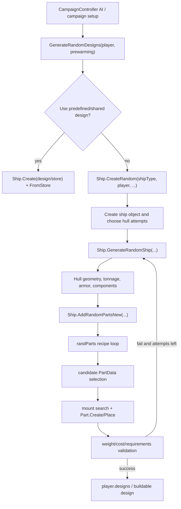

# Ship Generation Design Blueprint

This is a working map for campaign/random ship design generation in this checkout. It is grounded in the decompiled game shape first, then in the current TAF/DIP Harmony patches.

Current source marker observed:

- `TAF-RC7 GG Patch gg152`
- `3.20.3-gg152`

Main sources used:

- Decompiled signatures/fields: `E:\Codex\cpp2il_uad_diffable\DiffableCs\Assembly-CSharp\Ship.cs`, `CampaignController.cs`, `CampaignNewGame.cs`, `RandPart.cs`, `ShipType.cs`, `GameData.cs`
- Decompiled body flow: `E:\Codex\cpp2il_uad_isil\IsilDump\Assembly-CSharp\Ship_NestedType__CreateRandom_d__571.txt`, `Ship_NestedType__GenerateRandomShip_d__573.txt`, `Ship_NestedType__AddRandomPartsNew_d__591.txt`, `CampaignController_NestedType__GenerateRandomDesigns_d__202.txt`, `CampaignNewGame.txt`
- Current TAF patches: `TweaksAndFixes/Harmony/Ship.cs`, `TweaksAndFixes/Harmony/CampaignController.cs`, `TweaksAndFixes/Harmony/CampaignNewGame.cs`, `TweaksAndFixes/Modified/ShipM.cs`, `TweaksAndFixes/Harmony/GameData.cs`, `TweaksAndFixes/Modified/GameDataM.cs`
- Legacy/reference-only trap checked for gun armor zeroing: `UADRealism/Harmony/Ship.cs`, `UADRealism/ModifiedClasses/GenerateShip.cs`
- Current data: `TweaksAndFixes/Default_Files/UAD_Files/randParts.csv`, `parts.csv`, `shipTypes.csv`, `TweaksAndFixes/Default_Files/TAF_Files/params_override.csv`

## High-Level Flow



The key idea: `randParts.csv` does not directly say "put this exact part here." It defines recipes. A recipe becomes applicable to a hull, then the generator asks the part database for valid candidates, then it tries to instantiate and place those candidates on mounts or deck positions. A recipe being applicable is only the first gate; it can still produce no final placement.

## Decompiled Game Shape

The decompiled `Ship` class shows the three important coroutine entry points:

- `Ship.CreateRandom(ShipType shipType, Player player, ..., bool canUseShared, bool useSmallAmountTries)` creates or selects a design candidate.
- `Ship.GenerateRandomShip(Action<bool,int,float> onDone, bool needWait, ..., bool checkMainGunsCount, bool useSmallAmountTries, StringBuilder info)` is the main generator coroutine.
- `Ship.AddRandomPartsNew(bool needWait, Random rnd, bool isRefitMode, float? limitCaliber, bool isSimpleRefit, bool adjustDiameter, bool adjustLength)` is the randpart placement coroutine.

The generated state-machine fields are useful because they show what the game keeps live across frames:

- `CreateRandom`: `shipType`, `player`, `ignoreHullAvailability`, `canUseShared`, `usedHulls`, `sharedDesignSelected`, loop counter `i`.
- `GenerateRandomShip`: `adjustBeam`, `adjustDraught`, `adjustTonnage`, custom speed/range/armor/caliber limits, `triesTotal`, `tryN`, `randArmorRatio`, `componentsToInstall`.
- `AddRandomPartsNew`: `randPart` display class, `partDataForGroup`, `mainTowerPlaced`, `secTowerPlaced`, `secTowerNeedForShip`, `funnelsInstalled`, `maxFunnels`, `desiredAmount`, `chooseFromParts`, placement offsets.

The ISIL dump confirms the big call order inside `GenerateRandomShip`: tonnage/beam/draught adjustment, armor generation, component/hull-stat work, repeated calls to `ReduceWeightByReducingCharacteristics` and `AddedAdditionalTonnageUsage`, deletion of unmounted parts, then `AddRandomPartsNew`.

The TAF code names the game coroutine states as:

| State | `GenerateRandomShip` phase |
| --- | --- |
| 0 | setup |
| 1 | remove_parts |
| 2 | beam_draught |
| 3 | tonnage |
| 4 | clamp_tonnage |
| 5 | pre_hull_adjust |
| 6 | initial_hull_adjust |
| 7 | update_hull |
| 8 | add_parts |
| 9 | wait_update_parts |
| 10 | post_parts_adjust |
| 11 | validate_guns |
| 12 | reduce_validate |
| 13 | validate_cost_req |
| 14 | fill_tonnage |
| 15 | weight_tonnage_stabilize |
| 16 | post_fill_weight_check |
| 17 | post_reduce_refresh |
| 18 | post_refresh_fill_check |
| 19 | final_update_hull_stats |
| 20 | final_validate |

`AddRandomPartsNew` states are:

| State | `AddRandomPartsNew` phase |
| --- | --- |
| 0 | setup |
| 1 | select_randpart |
| 2 | place_parts |
| 3 | next_part |
| 4 | finish |

## RandPart Data Model

Decompiled `RandPart` fields match the CSV columns:

- `shipTypes`: ship types that receive the recipe.
- `chance`, `min`, `max`: chance and desired count range.
- `type`: `tower_main`, `tower_sec`, `funnel`, `special`, `gun`, `torpedo`, `barbette`, etc.
- `paired`: place mirrored pairs around the centerline.
- `group`: reuse the same selected part data across recipes in the same group.
- `effect`: placement/stat role, for example `main_center` or `main_side`.
- `center`, `side`: whether centerline or side placement is allowed.
- `rangeZFrom`, `rangeZTo`: normalized aft-to-forward placement band, `-1` aft through `+1` forward.
- `condition`: battery or part condition such as `main_cal`, `sec_cal`, `ter_cal`.
- `param`: parsed into `paramx`; contains `mount(...)`, `!mount(...)`, `and(...)`, `or(...)`, `delete_unmounted`, `scheme(...)`, and similar controls.

Decompiled `ShipType` has `List<RandPart> randParts` and `List<RandPart> randPartsRefit`. Decompiled `GameData` owns the global `randParts` and `randPartsRefit` dictionaries.

TAF hot reload in `GameDataM` reloads `randParts`/`randPartsRefit` CSV text, clears each ship type list, deserializes into `G.GameData.randParts`, then attaches each recipe to every `ShipType` named by `rp.shipTypes`. `GameData.PostProcessAll` runs `FixRandPart`, which normalizes odd `paramx` keys into `and`/`or` style conditions unless the key is one of the known randpart operators.

## RandParts CSV Semantics

The first real row after comments is:

```csv
@name,enabled,shipTypes,chance,min,max,type,paired,group,effect,center,side,rangeZFrom,rangeZTo,condition,param,#,#
```

Important reading rules:

- The `@name` often embeds a compact readable form such as `411/gun//mc/main_center/c//main_cal/or(tag[g2])`. The numeric id is the text before the first slash.
- `enabled` can disable a row. Example `445/...` currently has `enabled` set to `0`.
- `shipTypes` is the first broad applicability gate. `bb, bc` means the recipe attaches to battleship and battlecruiser type lists.
- `min`/`max` is the desired amount range. Very high max values such as `100` are generous "keep trying while possible" bounds, not a promise that 100 parts will appear.
- `group` such as `mc` makes the game reuse the same selected part data for recipes in that group, which is why centerline main gun recipes can coordinate caliber/model selection.
- `condition` such as `main_cal` classifies a gun recipe as main battery. TAF also uses this string to bucket and filter recipes.
- `param` is where mount and tag logic lives. `mount(barbette)` demands a mount type; `!mount(barbette)` excludes it. `or(tag[g2])` means this row is allowed if the hull has tag `g2`; with only one argument, it is effectively a required tag.

`ShipM.CheckOperation` is the clearest readable implementation of tag/zero checks:

- `tag[x]` checks `hull.paramx.ContainsKey("x")`.
- `zero[x]` checks `ship.TechVar("x") == 0` when a real ship exists.
- `!tag` and `!zero` invert those values.
- `or(...)` returns true if any operation succeeds.
- `and(...)` returns false if any operation fails.

Example from the recent investigation:

- `411/gun//mc/main_center/c//main_cal/or(tag[g2])` is applicable on `b1_3mast_spain` / `gazelle_hull_mast_d` because `parts.csv` gives that hull the tags `type(bb), BB_Pelayo, bb, g1, g2, earlybb_sideguns`.
- Applicability does not mean the recipe places well. A row can pass `CheckOperation`, accept candidate guns, and still produce `placed=0, final=0` after mount/placement and validation.

## Current TAF/DIP Shipgen Patches

Most current behavior is in `TweaksAndFixes/Harmony/Ship.cs`.

### Campaign Prewarm Guards

`Patch_CampaignNewGame` replaces vanilla `CampaignNewGame.ChangeFleetCreation` with a three-state selector:

- `Fleet: Auto-Generated`: vanilla-style generated starting fleets.
- `Fleet: Create Own`: vanilla custom starting fleet flow.
- `Fleet: Blank Slate`: start the campaign without generated starting warships.

The disassembled `CampaignNewGame.ChangeFleetCreation` only distinguishes entries containing `"Auto-Generated"`; all other entries display as `$Ui_NewGame_CreateOwn`. That is why TAF patches the method instead of only appending a third `fleetCreationTypes` entry. `CampaignNewGame.GetCreateOwnFleet()` returns true only when `fleetCreation == 1`, so Blank Slate (`fleetCreation == 2`) enters `CampaignController.Init(... createOwnFleet: false, ...)` like Auto-Generated, then uses the prewarm guards below to bypass the generated-fleet creation.

`UiM.ApplyMainMenuModifications()` must set the default fleet option explicitly via `Patch_CampaignNewGame.SetFleetCreationOption(..., FleetCreationCreateOwn)`. Do not call `ChangeFleetCreation(1)` for defaulting: with three options, repeated menu setup can rotate Create Own into Blank Slate and accidentally arm the pre-start skip on a normal campaign.

`Patch_Ship.ShouldUseBlankSlateCampaignStart()` checks the UI selection plus `taf_campaign_skip_prewarm_shipbuilding`. `Patch_Ship.ShouldSkipCampaignPrestartCreateRandom()` then skips `Ship.CreateRandom`/`Ship.GenerateRandomShip` only while Blank Slate is selected and campaign date year is still before `CampaignController.StartYear`.

`Patch_CampaignController.Prefix_BuildNewShips` also skips `BuildNewShips` during `_AiManageFleet.prewarming` when Blank Slate is selected.

Default parameter state:

- `taf_campaign_skip_prewarm_shipbuilding,1`

This parameter now acts as the Blank Slate feature gate / kill switch. Auto-Generated and Create Own are not supposed to use the pre-start skip path.

### AI Design / Build Diagnostics

Current `CampaignController` patches add:

- `taf_debug_ai_shipbuilding`: before/after logging around `BuildNewShips`, including design counts, class summaries, under-construction counts, approximate free capacity, and design tonnage range.
- `Ship._CreateRandom_d__571` tracing: `AI CreateRandom begin` and `AI CreateRandom end` for AI players when debug is enabled.
- Optional AI design service:
  - `taf_campaign_ai_design_service_enabled`
  - `taf_campaign_ai_design_service_disable_endturn_generation`
  - `taf_campaign_ai_design_service_start_delay_seconds`
  - `taf_campaign_ai_design_service_player_delay_seconds`
  - `taf_campaign_ai_design_service_cycle_delay_seconds`
  - `taf_debug_ai_design_service`

The AI design service is off by default. When enabled, it runs an always-on coroutine from `OnNewTurn`, invokes the private `GenerateRandomDesigns(Player,bool)` by reflection, and skips vanilla end-turn `GenerateRandomDesigns` unless the service itself owns that invocation.

### Hull Defaults And Tonnage

Current `ShouldUseMaxShipgenDisplacement` and `ShouldUseShipgenGeometryDefaults` both return true whenever `Config.ShipGenTweaks` is enabled and the ship/hull exists.

`ForceMaxShipgenDisplacement`:

- Applies deterministic geometry defaults.
- Finds max legal tonnage.
- Sets the generated ship to that max legal display tonnage.

Geometry defaults:

- `bb`: maximum beam, zero/default draught clamped to legal range.
- `tb`/`dd`: minimum beam and minimum draught.
- Other ship types: zero/default beam and draught clamped to legal range.

Max legal tonnage is clamped by:

- hull `TonnageMax()`
- player `TonnageLimit(shipType)`
- campaign shipyard capacity when applicable
- hull `TonnageMin()`

Important implementation detail: `SetShipgenTonnage` divides the target display tonnage by `Ship.BeamDraughtBonus()` before calling `SetTonnage`. If `SetTonnage` still clamps too low, it writes `ship.tonnage` directly and refreshes hull stats. That is necessary because decompiled/observed behavior shows displayed tonnage is raw tonnage multiplied by beam/draught bonus.

### Hull Profiles

`taf_shipgen_hull_profiles` supports hull-specific rules parsed by `ShipgenProfileForShip`.

Accepted keys include:

- `max_displacement`
- `min_beam_draught`, `min_beam_draft`, `min_dimensions`, `compact_geometry`
- `generator` / `special_generator` / `shipgen`
- `main_gun_max`
- `tower_tier_max`
- `tower <family>`

Default source value:

```csv
maine_hull_a:max_displacement=1,main_gun_max=9,tower_tier_max=1
```

Special generator note: `gg_tb_minimal` exists for `tb` ships when both the hull profile names it and `taf_shipgen_special_tb_generator_enabled` is `1`. It is disabled by default.

### Component Optimization

`OptimizeComponents` runs during shipgen after early states and again during postfix refresh.

Current goals:

- Prefer AP-heavy shell distribution:
  - `shell_ratio_main_2`
  - `shell_ratio_sec_2`
- Prefer penetrating shell types in DIP context:
  - AP priority: `ap_5`, `ap_2`, `ap_1`, `ap_0`, `ap_4`, `ap_3`
  - HE priority: `he_3`, `he_2`, `he_0`, `he_1`, `he_4`, `he_5`
- Prefer largest available torpedo diameter, `torpedo_diameter_9` down to `torpedo_diameter_0`.
- Search available engine/boiler/fuel combinations and keep the lightest combination.
- Normalize away some weight-saving choices:
  - `torpedo_prop_fast` back to `torpedo_prop_normal`
  - `shell_light` back to `shell_normal`

### RandPart Ordering And Pruning

At shipgen start, `ReorderShipgenRandPartsMainGunsFirst` rewrites the current ship type's randpart list when `taf_shipgen_main_gun_rules_first` is enabled.

Current ordering:

1. main/secondary towers
2. funnels
3. torpedoes first only for `tb`/`dd`
4. guns, ordered main before secondary before tertiary and side before center according to TAF's role/layout order
5. remaining recipes

Current pruning before the reordered list is written:

- `gun_other` recipes are removed.
- torpedo recipes are removed for `ca`, `bc`, and `bb` when `taf_shipgen_ban_torpedoes_above_cl` is enabled.
- barbette recipes are only removed if `taf_shipgen_skip_barbettes` is enabled; current default is `0`, so barbettes are not skipped by default.

Current hard-ban state:

- The hard-ban mechanism still exists in `IsHardBannedShipgenRandPart` and `ShouldSkipShipgenRandPart`.
- The current `_HardBannedShipgenMainGunRandParts` set is intentionally empty with the source comment "Temporarily empty for shipgen flow tracing."
- Earlier log-guided investigation recorded suspect/hard-ban candidates `49`, `52`, `411`, `368`, `391`, `392`, `399`, `439`, `440`, `442`, `443`, and `444`, but that is not the current active source state.

### Candidate Filtering

TAF prefixes the generated display-class filter `Ship.__c__DisplayClass590_0._GetParts_b__0`, which is called while the game is building candidate `PartData` lists for a randpart.

The patch records every candidate as one of:

- accepted
- game filter rejection
- TAF skipped randpart
- tower downsize rejection
- non-whole caliber rejection
- lower gun mark rejection
- main gun downsize cap rejection
- caliber group rejection

Current filters include:

- whole-inch generated gun calibers when `taf_shipgen_whole_inch_gun_calibers` is enabled
- standard gun length modifiers when `taf_shipgen_standard_gun_lengths` is enabled
- top available gun mark only when `taf_shipgen_top_gun_mark_only` is enabled
- adaptive main-gun downsize after failed attempts
- adaptive tower tier/weight downsize after failed attempts
- per-battery caliber grouping through `ShipM.CaliberLimiter`
- skip pipeline from `ShouldSkipShipgenRandPart`

The important diagnostic split is:

- `seen`: candidate reached TAF/game filtering.
- `accepted`: candidate survived filtering.
- `placed`: a part was actually created/placed.
- `final`: part survived to final ship.

Repeated `accepted > 0` with `placed=0`/`final=0` is much stronger evidence than "the recipe is applicable."

### Fast Retry At RandPart Boundaries

Current `taf_shipgen_fast_retry_category_boundaries` default is `1`.

The add-parts postfix watches bucket changes in `AddRandomPartsNew` state `1`. At a boundary, it can abort the current attempt early if a required class is already impossible or missing:

- after `tower_main`: missing required main tower
- after `tower_sec`: missing required secondary tower
- after `funnel`: missing required funnel
- after `torpedo`: missing required torpedo
- after `gun_main`: missing required `gun_main` stat requirement; hull `minMainTurrets`/`minMainBarrels` are ignored by default once `gun_main` is satisfied

It waits at least `taf_shipgen_fast_retry_min_seconds` before triggering so very fast early transitions do not instantly kill an attempt.

### Main-Gun Count Gate

Vanilla `GenerateRandomShip` state `11` is the real main-gun validation gate. The old UADRealism reference patch labels it `Verify maincal guns and barrels`, and the live TAF postfix only logs `Shipgen retry` after vanilla has already incremented the attempt counter. That means `main turrets X/Y` and `main barrels X/Y` retries are not just diagnostics; they are accepted/rejected by the vanilla state machine.

Current TAF behavior adds `taf_shipgen_ignore_min_main_gun_counts,1`. When enabled, the state-10 transition skips vanilla state `11` only if the ship is short on hull `minMainTurrets`/`minMainBarrels` but the real `gun_main(1)` ship-type requirement is already satisfied. The hard `gun_main=0` case still falls through to vanilla/state validation and later cost-requirement validation.

Related consequences:

- Fast retry no longer aborts after the `gun_main` bucket for soft count misses; it still aborts for missing `gun_main`.
- Downsize logic no longer treats soft count misses as "missing main guns" when the new parameter is enabled.
- Failure summaries omit soft `main turrets`/`main barrels` flags when they are ignored, but still report `unmet reqs: gun_main=0`.

### Tonnage Fill And Weight Recovery

Current generator changes:

- `taf_shipgen_skip_vanilla_beam_draught_state,1`: skip vanilla randomized beam/draught state after TAF geometry defaults.
- `taf_shipgen_skip_intermediate_tonnage_fill,1`: skip the game's repeated intermediate `AddedAdditionalTonnageUsage` pass.
- `taf_shipgen_skip_post_parts_adjust_hull_stats,1`: skip the post-parts fill-style hull adjustment pass.
- `taf_shipgen_final_armor_fill,1`: use spare final displacement for armor only, up to `taf_shipgen_final_armor_fill_target_ratio` (default `0.995`).

`ShipM.ReduceWeightByReducingCharacteristics` is the TAF replacement used when overweight. In order, it can reduce:

- DD multi-bottom to single bottom
- crew quarters
- shell size
- shell ammo
- torpedo ammo
- armor via `GenArmorData` or armor zone queues
- speed
- operational range
- bulkheads

The current design principle is to pass the real game weight validation rather than relaxing it.

### Gun Armor Storage And Zeroing Trace

Gun armor is not stored only in `ship.armor`. The game has a second per-gun store:

- `Ship.shipTurretArmor`: list of `Ship.TurretArmor` entries, one per caliber/casemate class.
- `Ship.TurretArmor.topTurretArmor`
- `Ship.TurretArmor.sideTurretArmor`
- `Ship.TurretArmor.barbetteArmor`

The disassembled `Ship.A` enum maps:

| Value | Zone |
| --- | --- |
| `10` | `TurretTop` |
| `11` | `TurretSide` |
| `12` | `Barbette` |

The disassembled `Ship.TurretArmor(PartData partData, Ship myShip = null)` constructor is important. When `myShip` is non-null, it reads the current ship armor dictionary for zones `10`, `11`, and `12`, clamps each value between `MinArmorForZone` and `MaxArmorForZone(zone, partData)`, rounds to the armor step, and writes those values into the per-gun fields. When `myShip` is null, those fields default to `0`.

The disassembled `Ship.AddShipTurretArmor(PartData partData, Ship myShip = null)` avoids duplicate entries by matching gun caliber and casemate status. When it needs a new entry, it calls the `TurretArmor(partData, myShipOrThisShip)` constructor above and appends that entry to `ship.shipTurretArmor`.

The disassembled `Ship.GetGunArmor(...)` reads the per-gun list, not just `ship.armor`. It scans/matches `ship.shipTurretArmor` entries and returns armor from `sideTurretArmor`, `topTurretArmor`, and `barbetteArmor`. Therefore a ship can show nonzero global armor zones while its actual gun armor is zero if the per-gun list was zeroed or never synced.

`Ship.SetArmor(Ship.A zone, float thickness, bool refreshHullStats = true)` and `Ship.SetArmor(Dictionary<Ship.A,float>)` update the `ship.armor` dictionary and refresh caches. The disassembly does not show these methods iterating `ship.shipTurretArmor` or updating per-gun turret armor entries. This matters for TAF final armor fill: `_this.SetArmor(a, newAmt, true)` can increase global `TurretSide`, `TurretTop`, or `Barbette` zones without repairing already-zero per-gun `TurretArmor` entries.

Legacy trap: `UADRealism/ModifiedClasses/GenerateShip.cs`

```csharp
// UADRealism/ModifiedClasses/GenerateShip.cs
foreach (var ta in _ship.shipTurretArmor)
    ta.topTurretArmor = ta.sideTurretArmor = ta.barbetteArmor = 0f;
```

This is a real all-zero write, but it belongs to the older `UADRealism` project, not the current `TweaksAndFixes.dll` path. Do not treat it as the current/live cause unless `UADRealism.dll` is explicitly deployed and loaded. In the current working setup, the active build/install target is `TweaksAndFixes/TweaksAndFixes.csproj`, and the root solution's Release config does not build `UADRealism`.

If that older generator is active, this block runs near the end of `GenerateShip.SelectParts()`, after:

1. successful randpart placement,
2. `CleanTCs()` and `CleanTAs()`,
3. adding missing `Ship.TurretArmor(data, _ship)` entries for generated guns.

So that legacy path intentionally discards the constructor-populated per-gun armor values after parts are selected.

The intended refill path in the legacy UADRealism generator is `GenerateShip.AddArmorToLimit() -> SetArmorValues(...)`. `SetArmorValues` iterates `ship.shipTurretArmor` and writes nonzero `topTurretArmor`, `sideTurretArmor`, and `barbetteArmor` from generated armor multipliers. However, `AddArmorToLimit` starts with:

```csharp
if (_ship.Weight() >= maxWeight)
    return;
```

`UADRealism/Harmony/Ship.cs` calls `gen.AddArmorToLimit(__instance.__4__this.Tonnage())` later in the generate-random coroutine. If that legacy path is active and the ship is already at or above target weight after part placement, the refill exits immediately and the earlier all-zero per-gun armor survives.

Current TAF trace:

- No live `TweaksAndFixes/` source path currently has an equivalent direct assignment to `Ship.TurretArmor.topTurretArmor`, `sideTurretArmor`, and `barbetteArmor` all at once. The only obvious zero assignments in TAF are in `MockTurretArmorStore`, a regular mock/store conversion class, not the live ship object.
- Live check on 2026-04-27: `Latest.log` shows `TAF-RC7 GG Patch gg143` and `Loaded 31 armor generation rules`. The live `Mods/genarmordata.csv` also includes `bb`, `bc`, `ca`, `cl`, `dd`, and `tb`, so this is not just a missing armor-rule-file problem.

Exact active write path for generated guns:

1. Disassembled `Ship_NestedType__AddRandomPartsNew_d__591.txt:9564` calls `Ship.AddShipTurretArmor` after placing a gun part.
2. Disassembled `Ship.txt:264380-264388` calls `TurretArmor..ctor(partData, myShipOrThisShip)`. If `myShip` is null, the method substitutes `this`, so the constructor normally receives the generated ship.
3. Disassembled `Ship_NestedType_TurretArmor.txt:721-749` reads `ship.armor[10]` (`TurretTop`), clamps/rounds it, and writes `topTurretArmor`.
4. Disassembled `Ship_NestedType_TurretArmor.txt:777-805` reads `ship.armor[11]` (`TurretSide`), clamps/rounds it, and writes `sideTurretArmor`.
5. Disassembled `Ship_NestedType_TurretArmor.txt:822-869` only writes `barbetteArmor` if `ship.armor` contains key `12` (`Barbette`); otherwise the field stays at its zero default.

So in the current TAF path, the practical "zeroing" point is not a TAF line that wipes existing gun armor. It is the vanilla `Ship.TurretArmor` constructor creating per-gun entries from global `ship.armor` values that are already zero or missing at gun-add time.

The intended TAF repair/sync path is `TweaksAndFixes/Data/GenArmorInfo.cs:258-335`: `GenArmorData.SetArmor(ship, portionOfMax)` rebuilds `ship.armor` and then iterates every `ship.shipTurretArmor` entry to update `sideTurretArmor`, `topTurretArmor`, and `barbetteArmor`. Its comment explicitly says it cannot early-out because new `TurretArmor` entries may have appeared.

Current source fix: that per-gun portion has been split into `GenArmorInfo.SyncTurretArmor(ship, portionOfMax)` and `ShipM.SyncShipgenTurretArmor(ship)`. The helper estimates the current armor lerp from `ship.armor`, then updates only `Ship.TurretArmor.sideTurretArmor`, `topTurretArmor`, and `barbetteArmor`. It does not change global armor, hull geometry, speed, range, crew, components, or other post-parts adjustment behavior.

Debug confirmation: when `taf_debug_shipgen_info=1`, `ShipM.SyncShipgenTurretArmor(ship)` prints one compact line:

```text
Turret armor sync: entries=N, zeroAll A->B, changed=True/False, lerp=X.XXX, global side=Y.YYin, top=Y.YYin, barbette=Y.YYin
```

Use `zeroAll A->B` as the quick confirmation. A good fix should usually show `A` greater than `B` when guns were born with all-zero armor. The phase summary should also include `call_post_parts_turret_armor_sync` and `call_post_parts_adjust_hull_stats_skipped`, proving the narrow sync ran while the broad post-parts adjustment remained skipped.

The current default generation flow can skip that repair after guns exist:

- `TweaksAndFixes/Harmony/Ship.cs:5815-5827` calls `ShipM.AdjustHullStats(..., delta: -1, ...)` before parts are added. This can populate global armor, but there are usually no gun armor entries yet.
- `TweaksAndFixes/Harmony/Ship.cs:5849-5854` defaults `taf_shipgen_skip_post_parts_adjust_hull_stats` to `1`, runs `ShipM.SyncShipgenTurretArmor(ship)`, records `call_post_parts_turret_armor_sync`, then records `call_post_parts_adjust_hull_stats_skipped`. It still does not call the broad post-parts `ShipM.AdjustHullStats(..., delta: 1, ...)` block at `5856-5870`.
- `Ship.SetArmor(Ship.A, float, bool)` and `Ship.SetArmor(Dictionary<Ship.A,float>)` do not sync `ship.shipTurretArmor`; the disassembly only updates `ship.armor` and cache/hull stats. Any later ordinary `SetArmor` call can leave already-created per-gun armor stale.
- `TweaksAndFixes/Modified/ShipM.cs:1115-1205` final armor fill uses ordinary `_this.SetArmor(a, newAmt, true)` calls. Those ordinary calls still do not repair per-gun entries.

Working diagnosis for current TAF: generated gun armor becomes zero when `Ship.TurretArmor(partData, ship)` is constructed while the global `ship.armor` turret/barbette zones are zero or missing. The fix is to keep skipping broad post-parts adjustment, but run the turret-only sync once guns exist.

Future fix candidates:

- For current TAF, add a post-parts/final step that syncs `ship.shipTurretArmor` after all guns exist, especially when `taf_shipgen_skip_post_parts_adjust_hull_stats` is enabled.
- Prefer reusing the `GenArmorData.SetArmor` per-gun rules when `GenArmorData.GetInfoFor(ship)` is available.
- If no `GenArmorData` is available, add a small helper that updates each `Ship.TurretArmor` from current `ship.armor[TurretTop/TurretSide/Barbette]`, clamped by `MaxArmorForZone(zone, ta.turretPartData)`.
- Only consider removing or replacing the explicit zero loop if `UADRealism.dll` is confirmed active.

## RandPart Examples From Current CSV

| Id | Meaning |
| --- | --- |
| `49` | BB old-predread centerline main gun, one forward recipe, gated by `old_predread`. |
| `52` | BB old-predread centerline main gun, one aft recipe, gated by `old_predread`. |
| `368` | BB/BC centerline main gun, `mount(barbette)`, min 2/max 100, broad Z range. |
| `391`/`392` | BB/BC paired side main guns, `main_side`, gated by `g2` or `!zero[use_main_side_guns]`. |
| `399` | BB/BC centerline main gun on barbette mounts, excluded for `g3` hulls. |
| `411` | BB/BC centerline main gun, one forward recipe, gated by `g2`. |
| `439` | BB/BC centerline main gun, no barbette mount, min 2/max 4, broad forward-ish Z band. |
| `440`/`442` | BB/BC centerline main gun on barbette mounts, min 2/max 100, forward/aft split. |
| `443` | BB/BC centerline main gun, no barbette mount, single forward-ish recipe. |
| `444` | BB/BC centerline main gun, no barbette mount, single aft/mid recipe. |

For future tuning, treat rows like `443`/`444` as separate placement recipes even when they choose the same gun family as another row. Their Z bands, mount constraints, and count requirements can make them fail differently.

## Where To Change Things Next

Use this decision tree:

- If a recipe is not applicable when it should be, check `randParts.csv` `shipTypes`, `param`, hull tags in `parts.csv`, and `ShipM.CheckOperation`.
- If a recipe is applicable but accepts no candidates, inspect `_GetParts_b__0` stats: TAF caliber/downsize/mark filters versus game filter rejection.
- If a recipe accepts candidates but places none, inspect mount constraints, `rangeZ`, `center`/`side`, paired behavior, and `Part.CanPlace`/`Part.Place` traces.
- If parts place but the design is rejected, inspect final issue flags: weight, cost requirements, main gun count/barrels, instability, and missing required stats.
- If a hull needs a narrow custom rule, prefer `taf_shipgen_hull_profiles` over global behavior.
- If a hull needs a completely different placement strategy, add it as a named profile generator like `gg_tb_minimal` rather than branching globally.
- If adding bans, prefer explicit source-visible ids only after repeated log evidence. The current code intentionally does not use dynamic learned bans.

Useful debug toggles:

- `taf_debug_shipgen_info`
- `taf_debug_shipgen_summary_only`
- `taf_debug_shipgen_main_gun_randpart_details`
- `taf_debug_shipgen_gun_randpart_list_limit`
- `taf_debug_shipgen_placement_trace`
- `taf_debug_shipgen_flow_trace`
- `taf_debug_shipgen_gun_normalization`
- `taf_debug_ai_shipbuilding`
- `taf_debug_ai_design_service`

Useful live log path:

```text
E:\SteamLibrary\steamapps\common\Ultimate Admiral Dreadnoughts\MelonLoader\Latest.log
```

## Cautions

- Do not treat Cpp2IL `DiffableCs` as full source; many method bodies are stubs. Use it for signatures/fields, and use the ISIL dump plus current Harmony patches for call order.
- Do not assume a recipe id is bad just because it appears in applicable diagnostics. Bad evidence is repeated accepted candidates with no placement/final survival, or repeated final validation failure.
- Do not assume source marker equals live DLL state unless the installed DLL/log marker has been checked.
- Current hard-ban source state is empty. If restoring prior bans, make that an explicit source edit and note which log evidence justified each id.
